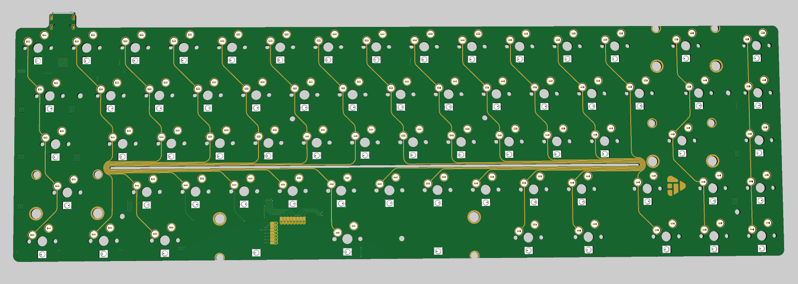
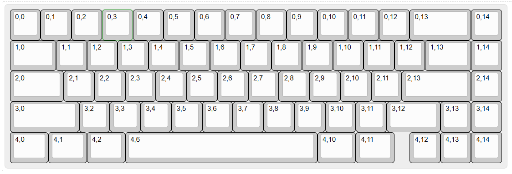

# silicon65

An open source 65% ANSI keyboard designed by KipperSun.

Based on [ZMK](https://github.com/zmkfirmware/zmk).

Support Bluetooth & USB double modes.

Support keyboard case: KBD67V2, KBD67V3, KBD67lite V1-V4, D65, Margo65, KBD Blade 65

# Features

- Use nRF52840 CoreBoard_Micro.
- Use the regular MX switch.
- Use 69 WS2812 RGB lights.

# Layout and Matrix
The [raw data](Assets/keyboard-layout.json) can be opened [here](https://www.keyboard-layout-editor.com/#/).

# Change this keymap
By forking this repository and change your keymap [here](https://nickcoutsos.github.io/keymap-editor/).
